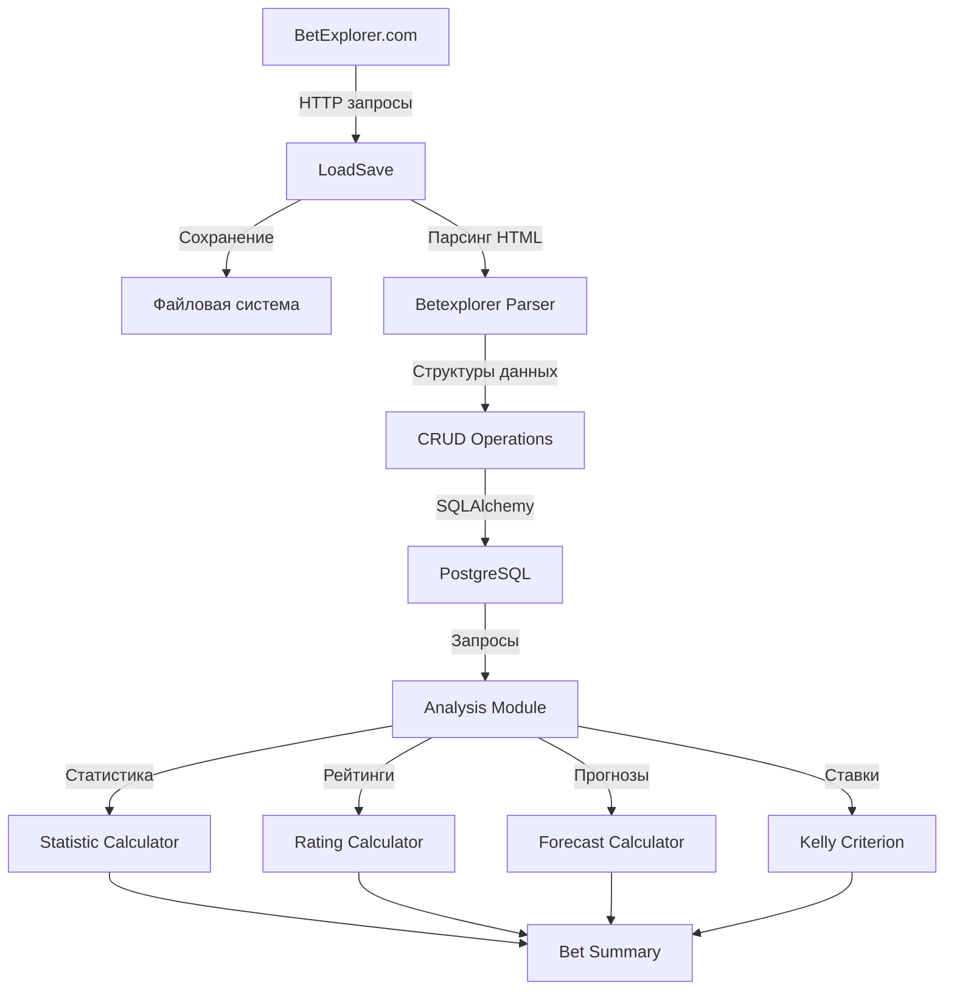

# AIBetExplorer - Архитектура системы

## Общая архитектура

Система построена по модульному принципу с четким разделением ответственности между компонентами. Основные модули:

1. **Модуль загрузки данных** (`app/betexplorer/`) - парсинг и сохранение данных с BetExplorer
2. **Модуль анализа** (`app/fbcup/`) - статистика, прогнозирование и расчет ставок
3. **Инфраструктурный слой** - работа с базой данных, файловая система, HTTP-запросы

## Диаграмма потоков данных



## Структура исходного кода

### app/betexplorer/

**betexplorer.py** (1233 строки)
- Основной модуль для загрузки и парсинга данных
- Функции парсинга: `parsing_countries`, `parsing_championships`, `parsing_results`, `parsing_match_time`
- Функции загрузки: `get_countries`, `get_results`, `get_match_time`
- Главная функция: `load_data()` - координирует весь процесс загрузки

**models.py** (312 строки)
- SQLAlchemy модели для всех таблиц базы данных
- Основные модели: `Sport`, `Country`, `Championship`, `Team`, `Match`, `TimeScore`, `Shooter`,
  `MatchEvent`, `ChampionshipStage`
- Использует декларативный подход SQLAlchemy 2.0

**schemas.py** (272 строки)
- TypedDict структуры для типизации данных
- Основные схемы: `SportBetexplorer`, `CountryBetexplorer`, `ChampionshipBetexplorer`,
  `TeamBetexplorer`, `MatchBetexplorer`
- Перечисление видов спорта: `SportType` enum

**crud.py** (908 строк)
- CRUD операции с базой данных
- Основные методы: `sports_insert_all`, `country_insert_all`, `insert_championship`, `team_merge`, `add_matches`
- Поддержка upsert операций для PostgreSQL и SQLite
- Режимы работы: `DATABASE_NOT_USE`, `DATABASE_READ_ONLY`, `DATABASE_WRITE_DATA`

### app/fbcup/

**analysis.py** (107 строк)
- Координация процесса анализа
- Функция: `analysis_championship()` - анализ одного чемпионата
- Функция: `one_championship_matches()` - анализ матчей чемпионата

**forecast.py** (156 строк)
- Расчет прогнозов результатов матчей
- Основные структуры: `ForecastInfo`, `MatchForecast`
- Функции: `create_forecast()`, `create_team_chances()`

**bet.py** (314 строк)
- Расчет ставок по критерию Келли
- Основные структуры: `KellyStake`, `BookmakerBet`, `MatchBet`, `KellyParams`
- Функции: `calc_kelly_stake()`, `calc_bet()`, `create_bet()`

**statistic.py** (199 строк)
- Расчет предматчевой статистики
- Основные структуры: `GoalStatistics`, `FieldTypeTotals`, `MatchStatistics`
- Функция: `calculate_league_prematch_stats()` - рассчитывает статистику для всех матчей

**rating.py** (218 строк)
- Расчет рейтингов команд
- Основная структура: `MatchRating`
- Функции: `old_rating()`, `new_rating()`, `calc_rating()`, `calc_match_probabilities_fbcup()`

**bet_summary.py** (91 строк)
- Итоги ставок на матчи
- Основная структура: `BetSummary`
- Функции: `calc_roi()`, `calc_bet_summary()`

**analys_config.py** (9 строк)
- Параметры конфигурации анализа
- Класс: `AnalysConfig` с параметром `round_number`

### Инфраструктурные модули

**database.py** (234 строки)
- Менеджер сессий базы данных
- Класс: `DatabaseSessionManager`
- Методы: `init()`, `get_session()`, `scoped_session()`, `get_test()`, `created_db_tables()`
- Поддержка PostgreSQL и SQLite

**utilbase.py** (304 строки)
- Утилиты для загрузки/сохранения данных
- Класс: `LoadSave` - HTTP запросы и работа с файловой системой
- Структуры: `ReceivedData`, `HTMLData`
- Поддержка кэширования на диске

**main.py** (42 строки)
- Точка входа для загрузки данных
- Функция: `load()` - запускает процесс загрузки

**analysis.py** (40 строк)
- Точка входа для анализа данных
- Функция: `load()` - запускает процесс анализа

## Ключевые паттерны проектирования

### 1. Асинхронная архитектура
- Все операции ввода-вывода асинхронные (asyncio)
- Использование aiohttp для HTTP запросов
- Использование aiofiles для файловых операций
- SQLAlchemy Async для работы с базой данных

### 2. Многопроцессорная обработка
- Использование `ProcessPoolExecutor` для параллельной загрузки
- Функция `wrapper()` для запуска асинхронных функций в процессах
- Менеджер `Manager()` для синхронизации между процессами

### 3. Кэширование данных
- Данные сохраняются на диск в формате HTTP
- Проверка даты модификации файла
- Возможность принудительного обновления (`need_refresh`)

### 4. Типизация данных
- Использование TypedDict для структур данных
- Использование dataclass для сложных объектов
- Полная типизация функций

### 5. Разделение слоев
- Слой данных: модели SQLAlchemy
- Слой доступа к данным: CRUD операции
- Слой бизнес-логики: анализ и прогнозирование
- Слой представления: отсутствует (CLI интерфейс)

## Поток выполнения загрузки данных

1. Инициализация `LoadSave` с настройками
2. Загрузка списка стран для вида спорта
3. Для каждой страны:
   - Загрузка списка чемпионатов
   - Для каждого чемпионата:
     - Загрузка результатов и расписания
     - Парсинг стадий чемпионата
     - Загрузка детальной информации о матчах (опционально)
     - Загрузка информации о командах
     - Сохранение в базу данных
4. Обновление статистики базы данных

## Поток выполнения анализа

1. Загрузка матчей чемпионата из базы данных
2. Расчет предматчевой статистики для каждого матча
3. Расчет рейтингов команд
4. Создание прогнозов на основе статистики и рейтингов
5. Расчет ставок по критерию Келли
6. Подсчет итогов и ROI

## Конфигурация

Все настройки находятся в `app/config_new.py`:
- `SQLALCHEMY_DATABASE_URI` - подключение к базе данных
- `DOWNLOAD_DIRECTORY` - каталог для загрузки данных
- `FBCUP_DIRECTORY` - каталог для вывода результатов
- `SPORT_TYPE` - список видов спорта для обработки
- `LOAD_NET` - загружать из сети или использовать кэш
- `LOAD_DETAIL` - загружать детальную информацию о матчах
- `SAVE_DATABASE` - режим работы с базой данных
- `PROCESSES` - количество процессов для многопроцессорной обработки

## Зависимости между модулями

```
app/main.py
  └─> app/betexplorer/betexplorer.py
        ├─> app/betexplorer/schemas.py
        ├─> app/betexplorer/crud.py
        │     ├─> app/betexplorer/models.py
        │     └─> app/database.py
        └─> app/utilbase.py

app/analysis.py
  └─> app/fbcup/analysis.py
        ├─> app/fbcup/forecast.py
        ├─> app/fbcup/bet.py
        ├─> app/fbcup/statistic.py
        ├─> app/fbcup/rating.py
        ├─> app/fbcup/bet_summary.py
        ├─> app/fbcup/analys_config.py
        ├─> app/betexplorer/crud.py
        └─> app/database.py
```
